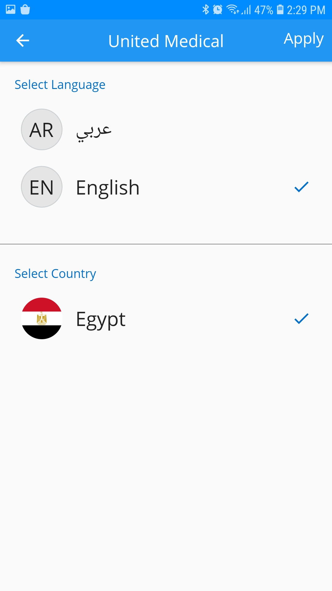

# GigaMax  (Users App)

Flutter E.commerce app . let users shop millions of products and manage  orders. Browse, shop by department, compare prices, read reviews, share products with friends, and check the status of  orders.

# GigaMax  (Seller App ) 
  A Smart App  sellers to receive and handle orders fast from the mobile.

### Features: (Users App)
1. Login,SignUp and login Facebook.
2. Manage and personalize your account.
3. Search, Browse, and Buy latest offers.
4. Save products to your wish list.
5. Edit and delete items from wishLists
6. Create Custom Wishlists. 
7. rating and review the products.
7. Add items to your shopping cart.
8. Manage your cart , edit and delete your orders list.
9. Manage your address book
10. payemnt integration with we accept
11. Track Orders

### Features: (Seller App)
1. seller Login.
2. View and fully control Orders.
3. Change order states.
4. Edit Products & Control Items Stock.
5. Update  Profile Data for seller.
6. dynamic help links allows sellers to open help links that are configured by main company.
6. receive General push notification. 

### ScreenShots:
### User
   
   
   

### Seller 
   
 
   
